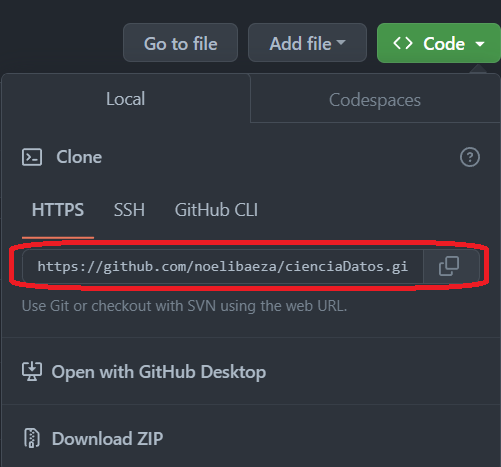

# Dipolmatura en Ciencia de Datos - UADER-FCyT 👩‍💻👨‍💻
## Trabajo Práctico - Modulo 2 
### Dataset: Salud del sueño y estilo de vida 😴
### Integrantes del grupo: Pablo Fontanini, Facundo Boladeras y Noelí Baeza

# Guía para la colaboración en GitHub 
## 1. Clonar el repositorio.

Antes de comenzar a colaborar, se debe clonar el repositorio en su máquina local utilizando el siguiente comando:

`git clone <url_del_repositorio>`

## 2. Crear una rama (branch) de trabajo
Es importante trabajar en ramas separadas para evitar conflictos directos con la rama principal. Pueden crear una nueva rama utilizando el siguiente comando:

`git checkout nombre_de_la_rama`  

pueden nombrar la rama con su nombre

## 3. Realizar cambios y hacer commits
Una vez que tienen tu rama de trabajo, puededen realizar los cambios necesarios en los archivos del proyecto (en este caso será el único Notebook). Para agregar sus cambios a la historia del repositorio, debes hacer commits con mensajes descriptivos. Aquí están los comandos básicos:

`git add archivo_modificado o indicando .`  
`git commit -m "Mensaje descriptivo"`

## 4. Actualizar tu rama con los últimos cambios
Antes de enviar los cambios al repositorio principal, es recomendable mantener sus ramas actualizada con los últimos cambios realizados los otros colaboradores. Pueden hacerlo ejecutando los siguientes comandos:

`git checkout main` Se mueven a la rama main   
`git pull origin main` Mantienen actualizados sus repositorios locales  
`git checkout nombre_de_la_rama` Se mueven a su rama  
`git merge main` Mezclan su rama con la rama principal  

